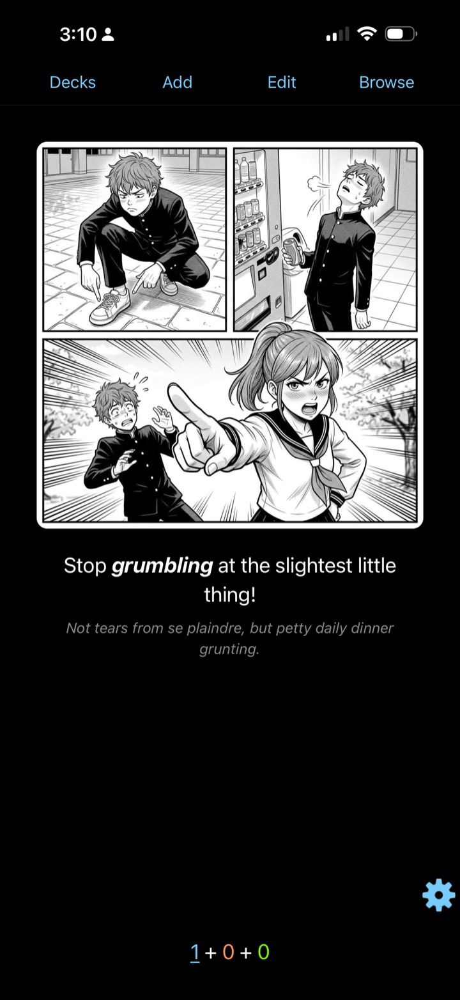
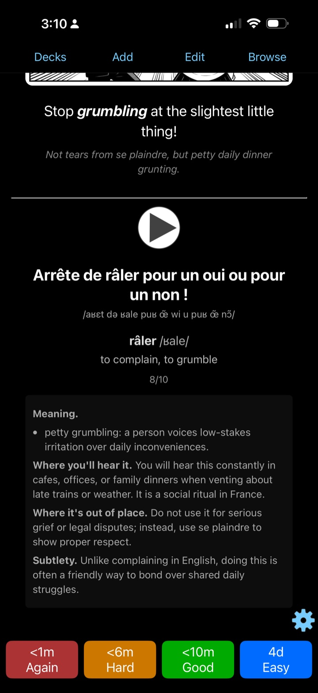

# kamishibai


A new word on its own is gone by next week — it needs a sentence to live in. **kamishibai** writes that sentence around every word you're learning and turns it into a card with native-speaker audio and an illustration that makes the word stick. One sentence per word, one card per sentence. You memorize phrases, not flashcards.

Drop the deck into Anki. That's it.

Built for people who actually do the reps: kamishibai multiplies your effort, it doesn't replace it. The rest is discipline — sadly, that part doesn't ship in the .apkg.

> Example Deck (EN→FR): [**PDF**](docs/samples/fr-en.pdf) · [**Anki APKG**](docs/samples/fr-en.apkg)

<br clear="left">

## Three ways to drive it

- **[By hand](#run)** — the TUI walks you from raw words to a finished deck.
- **[Headless](#console)** — a console API for scripts and agents that build decks on the fly; the contract is [llms.txt](llms.txt).
- **[Your own JSON](#bring-your-own-json)** — you write every sentence, kamishibai adds the voice and the picture; [the contract](docs/cards-json.md) covers every field.

## Why kamishibai

1. Spaced repetition turns recognition into recall — the gap between "I've seen this" and "I can use it".
2. Every sentence is written for its word — one sense, your language pair, nothing pulled from a textbook. Phrase by phrase, a language matrix forms in your head.
3. One word in, full card out in seconds — image, sentence, audio. No 20-minute manual workflow, no quality cut.
4. Natural emotional voice from Gemini. Real intonation, not robotic playback.
5. Designed to look good, especially for manga readers — learning shouldn't feel like a spreadsheet.
6. Bring your own Gemini key — your data, your control.

## Install

Install with the shell installer:

```bash
curl -fsSL https://raw.githubusercontent.com/anatoly-chichikov/kamishibai/main/install.sh | sh
```

Or through Homebrew:

```bash
brew install anatoly-chichikov/tap/kamishibai
```

## Run

```bash
kamishibai
```

kamishibai asks once — your language and your Gemini key, on the welcome screen — and remembers both. If `GEMINI_API_KEY` is set, the welcome screen offers to load it.

The TUI walks you from raw words through review to finished cards, and writes the `.apkg` plus a printable PDF into `Kamishibai` under your platform Documents folder.


### What You Get

kamishibai writes:

- an `.apkg` deck for Anki ([example](docs/samples/fr-en.apkg))
- a printable `.pdf` review sheet ([example](docs/samples/fr-en.pdf))

The front asks: the illustration, the sentence in your language, a hint. The back answers: the same sentence in the learning language, read by a native voice, with the gloss, IPA, and a usage note.

The printable sheet uses four fixed-size fold-cards per A4 page. Explanations show at most five reviewed meanings: the selected meaning first and bold, then the highest-priority alternatives. The complete meaning list stays available for choosing cards. Concise guidance on usage, unsuitable situations, and one useful nuance follows the glossary. Denser cards use tighter spacing within the same card size.

Import the deck into Anki, and the cards look roughly like this on your phone:

<p align="center">
  
  
</p>

## Console

The same flow runs headless without opening the TUI. Start with the
version-matched contract embedded in the installed binary:

```bash
kamishibai agent-contract
```

It covers first-time setup, JSON commands and errors, key handling, polling,
and output paths. The repository copy is [llms.txt](llms.txt).

## Bring Your Own JSON

You don't have to let Gemini write the cards. The card format is plain, strict JSON, and kamishibai takes it from anywhere: an LLM you prompt yourself, a script over your reading history, your own hands. Entries land on the cards verbatim — the writing pass is skipped — and kamishibai adds only what JSON can't carry: the audio and the illustration, both generated from the target sentence.

```bash
kamishibai cards.json                # review and build in the TUI
kamishibai new --build cards.json --json
kamishibai generate --json
```

Decks round-trip, too: `kamishibai result --json` returns the finished cards in the same schema, ready to edit and feed back in. See [the contract](docs/cards-json.md) for what each field is and where it lands on the card.

## Languages

Twenty-two languages:

- `en` English
- `zh` Chinese
- `es` Spanish
- `ja` Japanese
- `fr` French
- `de` German
- `ko` Korean
- `ru` Russian
- `it` Italian
- `pt` Portuguese
- `hi` Hindi
- `ar` Arabic
- `tr` Turkish
- `pl` Polish
- `uk` Ukrainian
- `id` Indonesian
- `vi` Vietnamese
- `th` Thai
- `el` Greek
- `he` Hebrew
- `nl` Dutch
- `cs` Czech

Choose your language once. The app uses it for card labels, then detects what you're learning from each batch: paste French words for a French deck, Japanese words for a Japanese deck. When a word lives in several languages at once, `Ctrl+L` sets the pair for that batch yourself.
